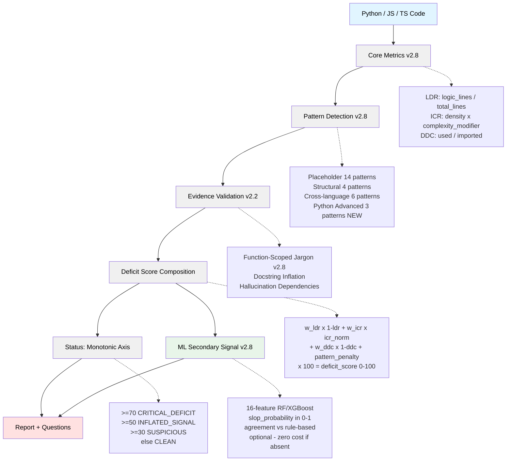

<p align="center">
  
</p>

# AI-SLOP Detector v2.9.0

[](https://pypi.org/project/ai-slop-detector/)
[](https://www.python.org/downloads/)
[](https://opensource.org/licenses/MIT)
[](tests/)
[](htmlcov/)

**Catches the slop that AI produces — before it reaches production.**

The problem isn't that AI writes code. The problem is the specific class of defects
AI reliably introduces: unimplemented stubs, disconnected pipelines, unreachable
structures, and buzzword-heavy noise that looks like substance.

AI-SLOP Detector surfaces these patterns through evidence-based static analysis.
It doesn't care whether the author is human, Claude, Cursor, or a custom agent.
**The code speaks for itself.**

---

**Quick Navigation:**
[Quick Start](#quick-start) •
[What's New](#whats-new-in-v280) •
[Architecture](#architecture-overview) •
[Math Models](docs/MATH_MODELS.md) •
[Core Features](#core-features) •
[Configuration](docs/CONFIGURATION.md) •
[CLI Usage](docs/CLI_USAGE.md) •
[CI/CD Integration](docs/CI_CD.md) •
[Development](docs/DEVELOPMENT.md)

---

## Quick Start

```bash
# Install from PyPI
pip install ai-slop-detector

# Analyze a single file
slop-detector mycode.py

# Scan entire project
slop-detector --project ./src

# With JS/TS support
pip install "ai-slop-detector[js]"
slop-detector --project ./src --js

# With ML secondary signal
pip install "ai-slop-detector[ml]"
slop-detector mycode.py --json   # ml_score included in output when model present

# CI/CD Integration (Soft mode - PR comments only)
slop-detector --project ./src --ci-mode soft --ci-report

# CI/CD Integration (Hard mode - fail build on issues)
slop-detector --project ./src --ci-mode hard --ci-report

# Generate JSON report
slop-detector mycode.py --json --output report.json

# List all available patterns (includes Python Advanced in v2.8)
slop-detector mycode.py --list-patterns

# History tracking (v2.9.0) - auto-recorded on every run
slop-detector mycode.py --show-history    # file trend over time
slop-detector --history-trends            # project-wide daily trends
slop-detector --export-history history.jsonl  # export for ML training
```

<p align="center">
  
</p>

---

## What's New in v2.8.0

### Rebuilt Mathematical Foundations

The three core scoring formulas have been redesigned from first principles.
Full specification: [docs/MATH_MODELS.md](docs/MATH_MODELS.md)

#### Inflation Score (ICR) — Complexity as Amplifier

Prior to v2.8.0, complexity *divided* the jargon penalty — a god function
could hide its jargon behind its own complexity. Now complexity multiplies it:

```
density   = unjustified_jargon / max(logic_lines, 1)
modifier  = max(1.0, 1.0 + (avg_complexity - 3.0) / 10.0)
inflation = min(density * modifier * 10.0, 10.0)
```

A function with cyclomatic complexity 13 receives **2x** the density penalty
vs. a simple function with the same jargon count. Complexity >= 3 amplifies;
complexity never reduces the penalty.

#### Status — Single Monotonic Axis

Status is now determined entirely by `deficit_score`:

```
deficit_score >= 70  -->  CRITICAL_DEFICIT
deficit_score >= 50  -->  INFLATED_SIGNAL
deficit_score >= 30  -->  SUSPICIOUS
else                 -->  CLEAN
```

Two supplementary overrides apply after: critical pattern count (>= 5 on
CLEAN files → SUSPICIOUS) and DDC ratio (< 0.20 → DEPENDENCY_NOISE).
Overrides can only raise status, never lower it.

#### Project LDR — SR9 Conservative Aggregation

```
project_ldr = 0.6 * min(file_ldrs) + 0.4 * mean(file_ldrs)
```

Worst-file weighted 60% (SR9 principle) prevents one clean majority from
masking a severely degraded file.

#### Function-Scoped Jargon Justification

Jargon justification scope changed from **file-level** to **function-level**.
A single `import torch` at the top of a file no longer justifies AI jargon
across every function — each function must contain its own justifier within
its scope (including decorator lines).

---

### Python Advanced Patterns (AST)

Three new structural patterns using Python `ast` module:

| Pattern       | Trigger                                       | Severity |
|---------------|-----------------------------------------------|----------|
| `god_function`| logic_lines > 50 OR cyclomatic complexity > 10 | HIGH    |
| `dead_code`   | statements after return/raise/break/continue  | MEDIUM   |
| `deep_nesting`| control-flow depth > 4                        | HIGH     |

Cyclomatic complexity: `1 + count(If, For, While, ExceptHandler, With, BoolOp)`

Nesting depth is computed recursively over `If/For/While/With/Try` bodies.
Dead code detection recurses into `orelse`, `finalbody`, and handler bodies.

### JS/TS Tree-Sitter Analysis

```bash
pip install "ai-slop-detector[js]"
slop-detector src/ --js
```

Full AST-based analysis: god functions, dead code, callback hell, cyclomatic
complexity, `var` usage, `any` type annotations. Graceful fallback to regex
when tree-sitter is not installed.

### ML Secondary Signal (Optional)

```bash
pip install "ai-slop-detector[ml]"
```

```python
detector = SlopDetector(model_path=Path("models/slop_classifier.pkl"))
result = detector.analyze_file("mycode.py")
# result.ml_score.slop_probability, .confidence, .label, .agreement
```

16-feature RandomForest/XGBoost classifier. Returns `None` silently when no
model file is present — zero cost for users who don't need ML.

Agreement: `(deficit_score >= 30) == (slop_probability >= 0.40)`

---

### Previous: v2.7.0 — VS Code Extension Upgrade

- Docstring inflation diagnostics, evidence claim validation, hallucination
  dependency detection, pattern fix suggestions, lint-on-type debounce

---

## What is AI Slop?

**AI Slop** refers to code patterns commonly produced by AI code generators that lack substance:

<p align="center">
  
</p>

### Pattern 1: Placeholder Code
```python
def quantum_encode(self, data):
    """Apply quantum encoding with advanced algorithms."""
    pass  # [CRITICAL] Empty implementation

def process_data(self):
    """Process data comprehensively."""
    raise NotImplementedError  # [HIGH] Unimplemented
```

**Detection:** 14 placeholder patterns (empty except, NotImplementedError, pass, ellipsis, return None, etc.)

### Pattern 2: Buzzword Inflation
```python
class EnterpriseProcessor:
    """
    Production-ready, enterprise-grade, highly scalable processor
    with fault-tolerant architecture and comprehensive error handling.
    """
    def process(self, data):
        return data + 1  # [CRITICAL] Claims without evidence
```

**Detection:** Cross-validates claims like "production-ready" against actual evidence (error handling, logging, tests, etc.)

### Pattern 3: Docstring Inflation
```python
def add(a, b):
    """
    Sophisticated addition algorithm with advanced optimization.

    This function implements a state-of-the-art arithmetic operation
    using enterprise-grade validation and comprehensive error handling
    with production-ready reliability guarantees.

    Args:
        a: First operand with advanced type validation
        b: Second operand with enterprise-grade checking

    Returns:
        Optimized sum with comprehensive quality assurance
    """
    return a + b  # [WARNING] 12 lines of docs, 1 line of code
```

**Detection:** Ratio analysis (docstring lines / implementation lines)

### Pattern 4: Hallucinated Dependencies
```python
# [CRITICAL] 10 unused purpose-specific imports detected
import torch  # ML: never used
import tensorflow as tf  # ML: never used
import requests  # HTTP: never used
import sqlalchemy  # Database: never used

def process():
    return "hello"  # None of the imports are actually used
```

**Detection:** Categorizes imports by purpose (ML, HTTP, database) and validates usage

---

## Architecture Overview

AI-SLOP Detector v2.8.0 uses a **multi-dimensional analysis engine** with an
optional ML secondary signal:



For the complete mathematical specification of each formula, see
[docs/MATH_MODELS.md](docs/MATH_MODELS.md).

<p align="center">
  
</p>

---

## Core Features

### 1. Context-Based Jargon Detection

Validates quality claims against actual codebase evidence:

```python
# Claims "production-ready" but missing:
# - error_handling
# - logging
# - tests
# - input_validation
# - config_management

# [CRITICAL] "production-ready" claim lacks 5/5 required evidence
```

**Evidence tracked (15 types):**

| Category | Evidence Types | Detection Signals |
|----------|----------------|-------------------|
| **Testing** | Unit tests | test functions, test files, test directories |
| | Integration tests | tests/integration path, pytest markers, TestClient/testcontainers |
| **Quality Assurance** | Error handling | try/except with non-empty handlers |
| | Logging | actual logger usage, not just imports |
| | Input validation | isinstance, type checks, assertions |
| | Documentation | meaningful docstrings |
| **Configuration** | Config management | settings, .env, yaml references |
| | Monitoring | prometheus, statsd, sentry |
| **Security** | Security measures | auth, encryption, sanitization |
| **Performance** | Caching | @cache, redis, memcache |
| | Async support | async/await usage |
| | Optimization | vectorization, memoization |
| **Reliability** | Retry logic | @retry, backoff, circuit breaker |
| **Architecture** | Design patterns | Factory, Singleton, Observer |
| | Advanced algorithms | complexity >= 10 |

### 2. Docstring Inflation Analysis

Detects documentation-heavy, implementation-light functions:

```python
Ratio = docstring_lines / implementation_lines

CRITICAL: ratio >= 2.0  (2x more docs than code)
WARNING:  ratio >= 1.0  (more docs than code)
INFO:     ratio >= 0.5  (substantial docs)
PASS:     ratio <  0.5  (balanced or code-heavy)
```

### 3. Placeholder Pattern Catalog

14 patterns detecting unfinished/scaffolded code:

**Critical Severity:**
- Empty exception handlers (`except: pass`)
- Bare except blocks

**High Severity:**
- `raise NotImplementedError`
- Ellipsis placeholders (`...`)
- HACK comments

**Medium Severity:**
- `return None` placeholders
- Interface-only classes (75%+ placeholder methods)

**Low Severity:**
- `pass` statements
- TODO/FIXME comments

### 4. Hallucination Dependencies

Categorizes imports by purpose and validates usage:

**12 Categories tracked:**
- ML: torch, tensorflow, keras, transformers
- Vision: cv2, PIL, imageio
- HTTP: requests, httpx, aiohttp, flask
- Database: sqlalchemy, pymongo, redis
- Async: asyncio, trio, anyio
- Data: pandas, polars, dask
- Serialization: json, yaml, toml
- Testing: pytest, unittest, mock
- Logging: logging, loguru, structlog
- CLI: argparse, click, typer, rich
- Cloud: boto3, google-cloud, azure
- Security: cryptography, jwt, passlib

### 5. Question Generation UX

Converts findings into actionable review questions:

```
CRITICAL QUESTIONS:
1. Only 14% of quality claims are backed by evidence.
   Are these marketing buzzwords without substance?

2. Claims like "fault-tolerant", "scalable" have ZERO supporting evidence.
   Where are the tests, error handling, and other indicators?

WARNING QUESTIONS:
3. (Line 4) "production-ready" claim lacks: error_handling, logging, tests.
   Only 20% of required evidence present.

4. Function "process" has 15 lines of docstring but only 2 lines of implementation.
   Is this AI-generated documentation without substance?

5. Why import "torch" for machine learning but never use it?
   Was this AI-generated boilerplate?
```

### 6. CI Gate 3-Tier System

Progressive enforcement for CI/CD pipelines:

**Soft Mode (Informational):**
```bash
slop-detector --project . --ci-mode soft --ci-report
# Posts PR comment, never fails build
# Use for: visibility, onboarding
```

**Hard Mode (Strict):**
```bash
slop-detector --project . --ci-mode hard --ci-report
# Fails build if deficit_score >= 70 or critical_patterns >= 3
# Exit code 1 on failure
# Use for: production branches
```

**Quarantine Mode (Gradual):**
```bash
slop-detector --project . --ci-mode quarantine --ci-report
# Tracks repeat offenders in .slop_quarantine.json
# Escalates to FAIL after 3 violations
# Use for: gradual rollout
```

**GitHub Action Example:**
```yaml
- name: Quality Gate
  run: |
    pip install ai-slop-detector
    slop-detector --project . --ci-mode quarantine --ci-report
```

---

## CLI Usage

```bash
# Single file
slop-detector mycode.py

# Project scan
slop-detector --project ./src

# CI/CD Integration
slop-detector --project . --ci-mode hard --ci-report

# With custom config
slop-detector --project ./src --config .slopconfig.yaml
```

📖 **[Complete CLI Reference →](docs/CLI_USAGE.md)**

---

## Configuration

Create `.slopconfig.yaml` for custom thresholds:

```yaml
weights:
  ldr: 0.40        # Logic Density Ratio
  inflation: 0.35  # Jargon Detection
  ddc: 0.25        # Dependency Check

thresholds:
  ldr:
    critical: 0.30
    warning: 0.60
```

⚙️ **[Full Configuration Guide →](docs/CONFIGURATION.md)**

---

## CI/CD Integration

```bash
# Soft mode - informational only
slop-detector --project . --ci-mode soft --ci-report

# Hard mode - fail build on issues
slop-detector --project . --ci-mode hard --ci-report

# Claim-based enforcement (v2.6.2)
slop-detector --project . --ci-mode hard --ci-claims-strict
```

🚦 **[CI/CD Integration Guide →](docs/CI_CD.md)**

---

## VS Code Extension

Real-time analysis in VS Code with inline diagnostics, debounced lint-on-type, and full CLI output surface.

Install from [VS Code Marketplace](https://marketplace.visualstudio.com/items?itemName=Flamehaven.vscode-slop-detector) or locally via `code --install-extension vscode-slop-detector-2.7.0.vsix`.

---

## Development & Contributing

Contributions welcome! Quick setup:

```bash
git clone https://github.com/flamehaven01/AI-SLOP-Detector.git
cd AI-SLOP-Detector
pip install -e ".[dev]"
pytest tests/ -v --cov
```

**Guidelines:** 80%+ coverage • Tests required • Follow code style

👨‍💻 **[Development Guide →](docs/DEVELOPMENT.md)**

---

## License

MIT License - see [LICENSE](LICENSE) file for details.

---

## Citation

If you use AI-SLOP Detector in research, please cite:

```bibtex
@software{ai_slop_detector,
  title = {AI-SLOP Detector: Evidence-Based Static Analysis for AI-Generated Code},
  author = {Flamehaven},
  year = {2024},
  version = {2.7.0},
  url = {https://github.com/flamehaven01/AI-SLOP-Detector}
}
```

---

## Acknowledgments

- Built with Python 3.8+
- AST analysis powered by Python's `ast` module
- Pattern detection inspired by traditional linters
- Evidence validation methodology developed in-house
- Thanks to the open-source community

---

## Roadmap

**v2.8 (Current):**
- [x] Inflation formula redesign — complexity as amplifier
- [x] Monotonic status axis (single deficit_score threshold)
- [x] SR9 conservative project LDR aggregation
- [x] Function-scoped jargon justification
- [x] Python Advanced patterns: god_function, dead_code, deep_nesting
- [x] JS/TS tree-sitter AST analysis (`[js]` extra)
- [x] ML secondary signal — RandomForest/XGBoost (`[ml]`, `[ml-full]` extras)
- [x] docs/MATH_MODELS.md — formal mathematical specification

**v2.9 (Planned Q2 2026):**
- [ ] Real training data pipeline (GitHub corpus sampling)
- [ ] Enhanced CI/CD integrations (GitLab CI, CircleCI)
- [ ] Custom pattern DSL for user-defined rules
- [ ] Real-time analysis daemon mode

**v3.0 (Planned Q3 2026):**
- [ ] Auto-fix suggestions with confidence scores
- [ ] IDE plugins (PyCharm, IntelliJ)
- [ ] Team analytics dashboard
- [ ] Enterprise features (SSO, RBAC)

---

## Support

- **Documentation:** [docs/](docs/)
- **Issues:** [GitHub Issues](https://github.com/flamehaven01/AI-SLOP-Detector/issues)
- **Discussions:** [GitHub Discussions](https://github.com/flamehaven01/AI-SLOP-Detector/discussions)

---

**Made with ❤️ by Flamehaven | Detecting AI slop since 2024**
